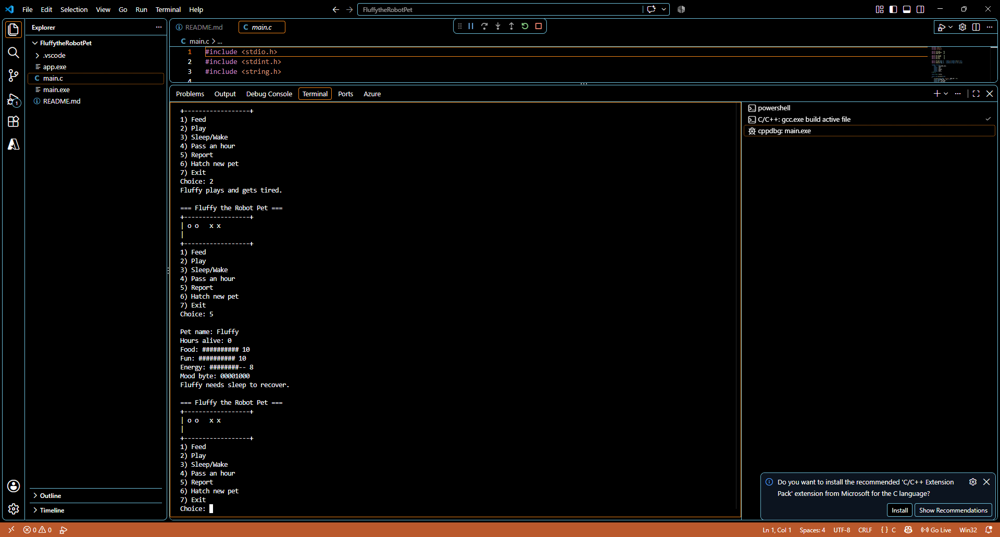

## name : Tasneem Hossam El-Din Hassan Salem

## email : tasneem.hossameldin@outlook.com

# Project 4 — Fluffy the Robot Pet

## What this program does
This program simulates a tiny robot pet called Fluffy. The user can feed it, play with it, put it to sleep or wake it up, advance time by one hour, and view a status report. The pet tracks food, fun, energy, mood bits, and age in hours.

## Build and run
From the project folder:

```bash
gcc -std=c99 -Wall -Wextra -o app main.c
./app
```

On Windows PowerShell:

```powershell
gcc -std=c99 -Wall -Wextra -o app.exe main.c
.\app.exe
```

## Notes on the behavior
- Food, fun, and energy stay within the 0..10 range.
- Hungry, sad, asleep, and sick are tracked using the bit flags defined in the project and are only modified through the provided bit macros.
- A full Fluffy that is fed again becomes sick, and sickness clears only after a sleep cycle.
- Each hour reduces food and fun, and applies the energy change depending on whether Fluffy is asleep or awake.

## Verification
The program was compiled with:

```bash
gcc -std=c99 -Wall -Wextra -o app main.c
```

and completed without warnings.

